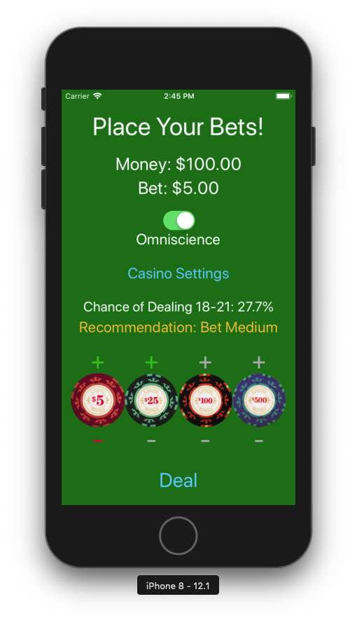
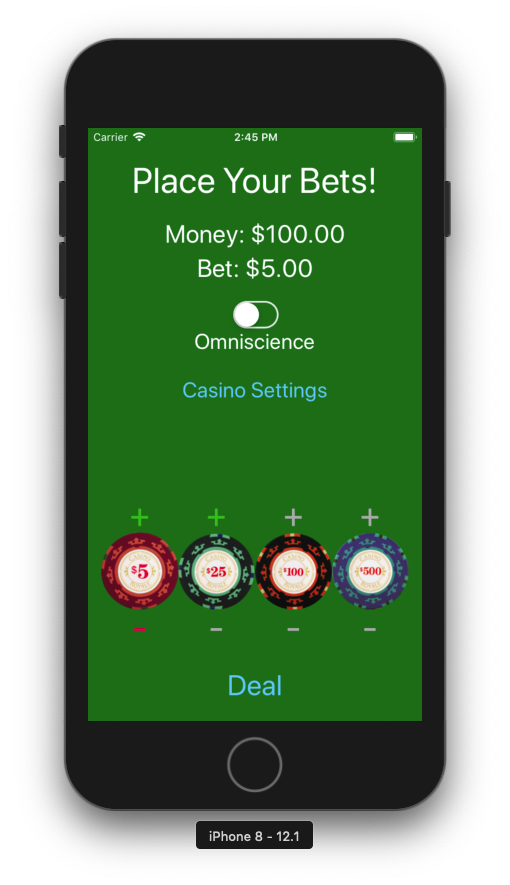
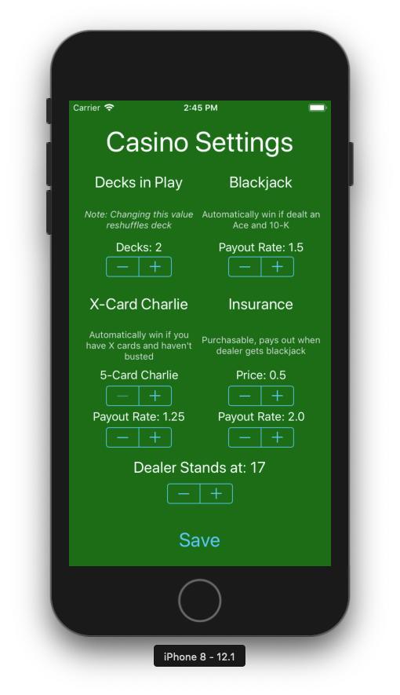
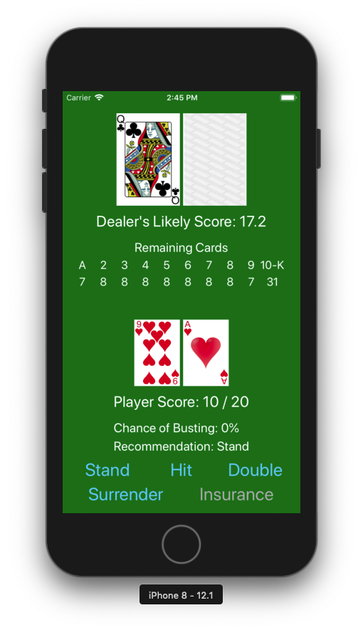
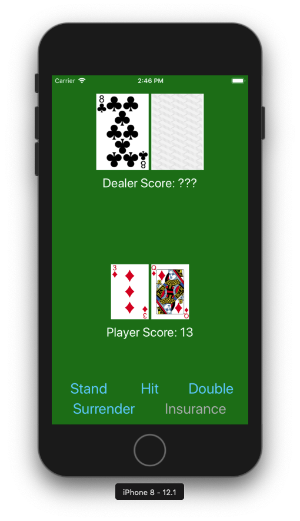

# Omniscient Blackjack
iOS blackjack game that provides useful information/probabilities to improve chance of winning.

This project was coded in Swift and developed for iOS using Xcode.

The aim of this project was to create a blackjack game where the player feels like they're omniscient, while still keeping the game from being to easy. This was achieved by keeping track of what cards are left in the deck (essentially card counting for the player) in order to predict what the dealer's score is and what the player should do next. 

The game also comes with some settings to tweak how the game works: Payout rates, number of decks, when the dealer should stand, etc.

## Screens
### Betting Screen (Home Screen)
This is the main screen where players can change their bets, go to settings, play a round, and most importantly toggle the omniscience feature, which will show additional information on this screen and the play screen.

#### Omniscient

#### Not Omniscient (Regular)

### Settings Screen
This screen allows users to tweak the game to suit their liking. More times than not, this means jacking up the payout rates so you win more $$$.

### Play Screen
This is where the actual gameplay takes place and the player tries to score as close to 21 as possible without busting.
#### Omniscient
Note that the omniscient view allows the player to see which cards are remaining, the dealer's likely score, the chance of busting, and a recommendation for which move to make.

#### Not Omniscient
Most features are stripped, leaving only the basics.

